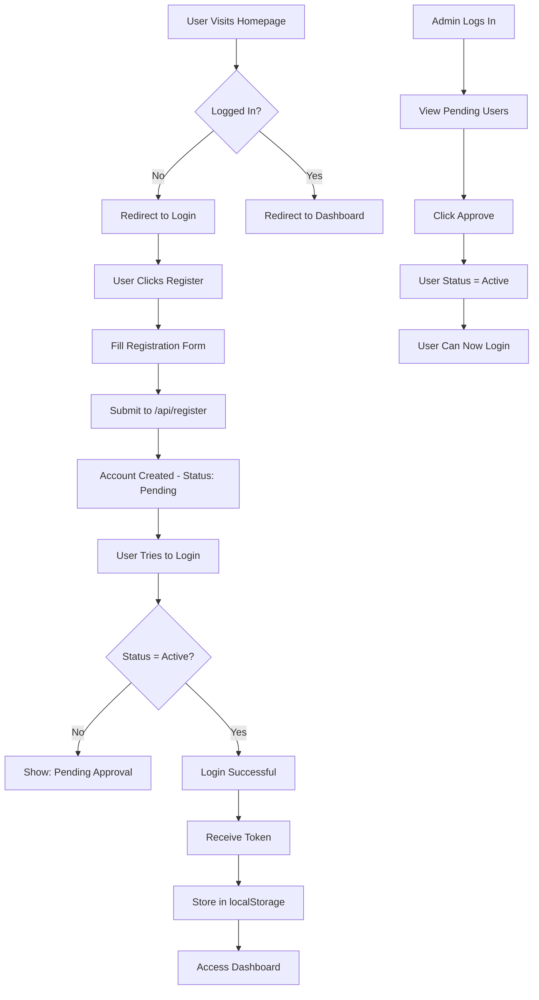

# 🚀 Laravel + Next.js Authentication System

A modern, full-stack SaaS web application with **Laravel 12** backend API and **Next.js 15** frontend, featuring a complete user authentication system with admin approval workflow.

---

## 📋 Table of Contents

- [Overview](#overview)
- [Tech Stack](#tech-stack)
- [Features](#features)
- [Project Structure](#project-structure)
- [Installation](#installation)
- [API Documentation](#api-documentation)
- [Authentication Flow](#authentication-flow)
- [License](#license)

---

## 🎯 Overview

This project implements a complete authentication system where:
1. **Users register** but cannot login until approved
2. **Admins** can view and approve/reject pending users
3. **Approved users** can access protected dashboard
4. **Role-based access control** (Admin/User)
5. **Beautiful UI** with Ant Design components

---

## 🛠 Tech Stack

### Backend (Laravel 12)
| Technology | Purpose |
|------------|---------|
| **Laravel 12** | PHP framework for API |
| **Laravel Sanctum** | Token-based authentication |
| **MySQL / SQLite** | Database |
| **RESTful API** | JSON responses only |
| **Custom CORS** | Cross-origin request handling |

### Frontend (Next.js 15)
| Technology | Purpose |
|------------|---------|
| **Next.js 15** | React framework (App Router) |
| **TypeScript** | Type-safe JavaScript |
| **Ant Design 5** | UI component library |
| **Axios** | HTTP client with interceptors |
| **React 18** | UI library |

### DevOps
- Apache with HTTPS
- Nginx reverse proxy
- Docker containerization

---

## ✨ Features

### 🔐 Authentication
- ✅ User registration with email validation
- ✅ Password confirmation
- ✅ Account status management (pending/active/inactive)
- ✅ Token-based authentication with Sanctum
- ✅ Secure password hashing
- ✅ Protected API routes

### 👨‍💼 Admin Dashboard
- ✅ View all pending user registrations
- ✅ Approve/reject user accounts
- ✅ View all users with status indicators
- ✅ Admin-only access control
- ✅ Real-time user management

### 🎨 User Experience
- ✅ Beautiful gradient UI design
- ✅ Toast notifications for all actions
- ✅ Loading states and error handling
- ✅ Responsive design
- ✅ Form validation with helpful messages
- ✅ Auto-redirect based on auth state

### 🔒 Security
- ✅ CORS protection
- ✅ Token expiration handling
- ✅ Role-based access control (RBAC)
- ✅ SQL injection protection (Laravel ORM)
- ✅ XSS protection
- ✅ Password hashing (bcrypt)

---

## 📁 Project Structure

```
laravel-product-BC-app/
│
├── backend/                                   # Laravel 12 API
│   ├── app/
│   │   ├── Http/Controllers/Api/
│   │   │   ├── AuthController.php            # Register, login, logout, getUser
│   │   │   ├── AdminController.php           # Approve/reject users
│   │   │   └── TestController.php            # Test endpoint
│   │   └── Models/
│   │       └── User.php                      # User model (HasApiTokens)
│   │
│   ├── config/
│   │   ├── auth.php                          # Sanctum guard config
│   │   └── sanctum.php                       # Token settings
│   │
│   ├── database/migrations/
│   │   └── create_users_table.php            # Users: id, name, email, password, status, role
│   │
│   ├── public/
│   │   ├── .htaccess                         # CORS headers configuration
│   │   └── index.php                         # Entry point
│   │
│   ├── routes/
│   │   └── api.php                           # All API endpoints
│   │
│   └── .env                                  # Environment configuration
│
├── frontend/                                  # Next.js 15 Frontend
│   ├── src/
│   │   ├── app/
│   │   │   ├── admin/page.tsx               # Admin approval panel
│   │   │   ├── dashboard/page.tsx           # User dashboard
│   │   │   ├── login/page.tsx               # Login form
│   │   │   ├── register/page.tsx            # Registration form
│   │   │   ├── layout.tsx                   # Root layout
│   │   │   ├── providers.tsx                # Ant Design provider
│   │   │   └── page.tsx                     # Home (redirect)
│   │   │
│   │   └── lib/
│   │       └── axios.ts                     # Axios config + interceptors
│   │
│   ├── next.config.ts                       # Next.js configuration
│   ├── tsconfig.json                        # TypeScript config
│   └── package.json                         # Dependencies
│
├── .gitignore                               # Git ignore patterns
├── README.md                                # This file
├── AUTH_SETUP.md                            # Complete setup guide
├── QUICK_FIX.md                             # Troubleshooting
└── HYDRATION_FIX.md                         # React hydration fixes
```

---

## 🚀 Installation

### Prerequisites
- PHP >= 8.2
- Composer
- Node.js >= 18
- MySQL or SQLite

### Backend Setup

```bash
# Navigate to backend
cd backend

# Install PHP dependencies
composer install

# Copy environment file
cp .env.example .env

# Generate application key
php artisan key:generate

# Configure database in .env
DB_CONNECTION=sqlite
# Or use MySQL:
# DB_CONNECTION=mysql
# DB_HOST=127.0.0.1
# DB_DATABASE=your_database

# Run migrations
php artisan migrate

# Create admin user
php artisan tinker
```

In Tinker console:
```php
$admin = new App\Models\User();
$admin->name = 'Admin';
$admin->email = 'admin@example.com';
$admin->password = Hash::make('password123');
$admin->role = 'admin';
$admin->status = 'active';
$admin->save();
exit
```

### Frontend Setup

```bash
# Navigate to frontend
cd frontend

# Install dependencies
npm install

# Start development server
npm run dev
```

Visit: `http://localhost:3000`

---

## 📡 API Documentation

### Public Endpoints

#### Register User
```http
POST /api/register
Content-Type: application/json

{
  "name": "John Doe",
  "email": "john@example.com",
  "password": "password123",
  "password_confirmation": "password123"
}

Response: 201 Created
{
  "message": "Registration successful. Your account is pending approval.",
  "user": {
    "id": 1,
    "name": "John Doe",
    "email": "john@example.com",
    "status": "pending"
  }
}
```

#### Login
```http
POST /api/login
Content-Type: application/json

{
  "email": "admin@example.com",
  "password": "password123"
}

Response: 200 OK
{
  "message": "Login successful",
  "token": "1|abc123...",
  "user": {
    "id": 1,
    "name": "Admin",
    "email": "admin@example.com",
    "role": "admin",
    "status": "active"
  }
}
```

### Protected Endpoints (Require: `Authorization: Bearer {token}`)

#### Get Current User
```http
GET /api/user
Authorization: Bearer {token}

Response: 200 OK
{
  "user": {
    "id": 1,
    "name": "Admin",
    "email": "admin@example.com",
    "role": "admin",
    "status": "active"
  }
}
```

#### Logout
```http
POST /api/logout
Authorization: Bearer {token}

Response: 200 OK
{
  "message": "Logged out successfully"
}
```

### Admin Endpoints (Require: Admin role)

#### List Pending Users
```http
GET /api/admin/pending
Authorization: Bearer {token}

Response: 200 OK
{
  "users": [
    {
      "id": 2,
      "name": "John Doe",
      "email": "john@example.com",
      "status": "pending",
      "created_at": "2025-01-15T10:30:00"
    }
  ]
}
```

#### Approve User
```http
POST /api/admin/approve/{id}
Authorization: Bearer {token}

Response: 200 OK
{
  "message": "User approved successfully.",
  "user": {
    "id": 2,
    "name": "John Doe",
    "email": "john@example.com",
    "status": "active"
  }
}
```

#### List All Users
```http
GET /api/admin/users
Authorization: Bearer {token}

Response: 200 OK
{
  "users": [...]
}
```

---

## 🔄 Authentication Flow



---

## 🎨 Features Breakdown

### User Registration Flow
1. User fills registration form
2. Backend validates email uniqueness & password strength
3. User created with `status = pending`
4. User redirected to login with success message
5. Login blocked until admin approval

### Admin Approval Flow
1. Admin logs in with admin credentials
2. Views list of pending users
3. Clicks "Approve" or "Reject"
4. User status updated to `active` or `inactive`
5. User receives appropriate message on next login

### Protected Routes
- All `/api/user` endpoints require valid token
- All `/api/admin/*` endpoints require admin role
- Token expires based on Sanctum configuration
- Automatic redirect to login on 401 errors

---

## 🔧 Configuration

### Laravel Environment Variables
```env
APP_NAME=Laravel
APP_ENV=local
APP_KEY=base64:...
APP_DEBUG=true
APP_URL=http://localhost

DB_CONNECTION=sqlite
# DB_CONNECTION=mysql
# DB_HOST=127.0.0.1
# DB_DATABASE=laravel
```

### Next.js Environment (if needed)
```env
NEXT_PUBLIC_API_URL=https://laravel-product-bc-app.local/api
```

---

## 📚 Documentation

- **[AUTH_SETUP.md](AUTH_SETUP.md)** - Complete authentication system documentation with code examples
- **[QUICK_FIX.md](QUICK_FIX.md)** - Step-by-step troubleshooting for common issues
- **[HYDRATION_FIX.md](HYDRATION_FIX.md)** - Solutions for React hydration errors

---

## 🐛 Troubleshooting

### CORS Errors
- Check `.htaccess` has CORS headers
- Verify `localhost:3000` is allowed origin
- Clear Laravel config: `php artisan config:clear`

### 500 Internal Server Error
- Check Laravel logs: `storage/logs/laravel.log`
- Run migrations: `php artisan migrate`
- Verify database connection

### Notifications Not Showing
- Ensure `providers.tsx` wraps app
- Check React version is 18
- Clear Next.js cache: `rm -rf .next`

---

## 📄 License

MIT License

---

## 👨‍💻 Author

Built with Laravel 12, Next.js 15, and Claude AI assistance.

---

## 🙏 Acknowledgments

- Laravel Framework
- Next.js Team
- Ant Design
- Laravel Sanctum
